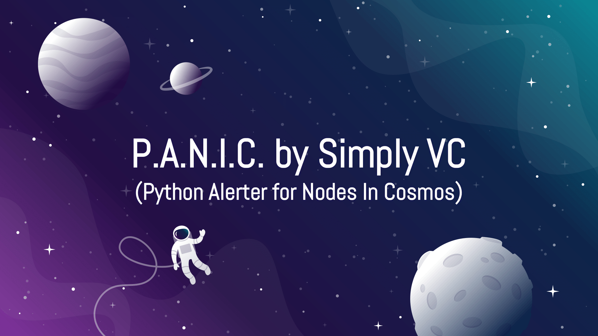

# PANIC for Cosmos

This Repo has been archived. Cosmos node monitoring and alerting has been integrated into [this product](https://github.com/SimplyVC/panic), which we now actively maintain.

PANIC for [Cosmos](https://cosmos.network/) is a lightweight yet powerful open source monitoring and alerting solution for Cosmos nodes by [Simply VC](https://simply-vc.com.mt/). It is compatible with any chain built using the Cosmos SDK. The tool was built with user friendliness in mind, without excluding cool and useful features like phone calls for major alerts and Telegram commands for increased control over your alerter.

The alerter's focus on a modular design means that it is beginner friendly but also developer friendly. It allows the user to decide which components of the alerter to set up while making it easy for developers to add new features. PANIC also offers two levels of configurability, _user_ and _internal_, allowing more experienced users to fine-tune the alerter to their preference.

We are sure that PANIC will be beneficial for node operators in the Cosmos community and we look forward to feedback. Feel free to read on if you are interested in the design of the alerter, if you wish to try it out, or if you would like to support and contribute to this open source project, or just check out upcoming features.

### Design and Features

[Click here](doc/DESIGN_AND_FEATURES.md) if you want to dive into the design and feature set of PANIC

### Ready, Set, Alert!

[Click here](doc/INSTALL_AND_RUN.md) if you are ready to try out PANIC on your Cosmos nodes!

### Support and Contribution

On top of the additional work that we will put in ourselves to improve and maintain the tool, any support from the community, both through development work or by delegating to the [Simply VC validator](https://simply-vc.com.mt/cosmos), will be greatly appreciated.

### Who We Are
Simply VC runs highly reliable and secure infrastructure in our own datacentre in Malta, built with the aim of supporting the growth of the blockchain ecosystem. Read more about us on our website and Twitter:

- Simply VC website: <https://simply-vc.com.mt/>
- Simply VC Twitter: <https://twitter.com/Simply_VC>

### Further Reading

If you wish to read more about monitoring and alerting on Cosmos, check out [our article on Medium](<https://medium.com/simply-vc/cosmos-monitoring-and-alerting-for-validators-8e3f016c9567>).

---

Official PANIC by Simply VC image adapted from [slidescarnival.com](https://www.slidescarnival.com/)
