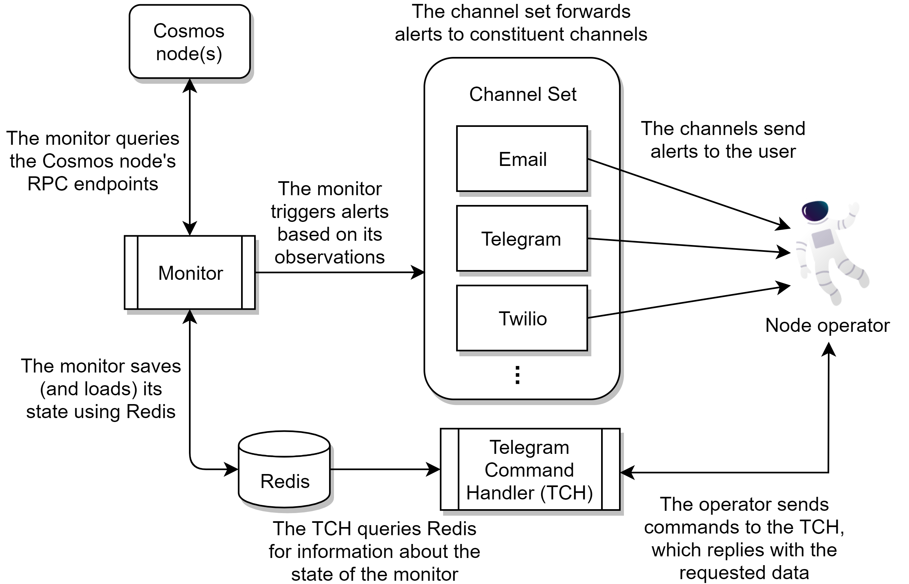
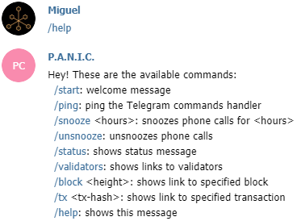
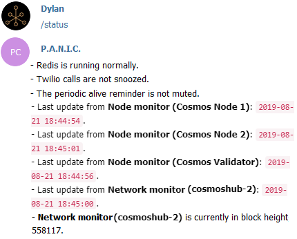

# Design and Features

This page will present the inner workings of the alerter as well as the features that one is able to interact with and how. The following points will be presented and discussed:

- **Design**
- **Alerting Channels**: (console, logging, Telegram, email, Twilio)
- **Alert Types**: (major, minor, info, error)
- **Monitor Types**: (node, network, GitHub)
- **Periodic Alive Reminder**
- **Telegram Commands**
- **Redis**
- **Complete List of Alerts**

## Design

The below diagram gives an idea of the various components at play when P.A.N.I.C. is running, and how they interact with each other and the node operator:

## Alerting Channels

P.A.N.I.C. currently supports five alerting channels. By default, only console and logging alerts are enabled, allowing the node operator to run the alerter without having to set up extra alerting channels. This is not enough for a more serious and longer-term alerting setup, for which the node operator should set up the remaining alerting channels.

- **Console**: alerts printed to standard output (`stdout`).
- **Logging**: alerts logged to an alerts log (`logs/alerts/alerts.log`).
- **Telegram**: alerts delivered to a Telegram chat via a Telegram bot.
- **Email**: alerts sent as emails using an SMTP server, with option for authentication.
- **Twilio**: alerts trigger a phone call to grab the node operator's attention.

Instructions on how to set up the alerting channels can be found in the [installation guide](./INSTALL_AND_RUN.md).

## Alert Types

Different events vary in severity. We cannot treat an alert for a new version of the Cosmos SDK as being on the same level as an alert for validator downtime. P.A.N.I.C. makes use of four alert types:

- **MAJOR**: the most severe alert and the only type of alert that uses the Twilio phone calling. Example: validator misses 10 blocks in a row.
- **MINOR**: a less severe alert but which still requires attention as it may be a warning of an incoming major alert. Example: validator misses multiple blocks.
- **INFO**: little to zero severity but consists of information which is still important to acknowledge. Info alerts also include positive events. Example: change in voting power.
- **ERROR**: triggered by abnormal events and ranges from zero to high severity based on the error that has occurred and how many times it is triggered.

## Monitor Types

An aspect of the design of P.A.N.I.C. that is less visible to the user is that there are multiple monitor types. Once the alerter is started, it detects the number of nodes and which network(s) they belong to and automatically launches the necessary number of monitors of each type.

- **Node monitor** (one per node): deals with node-specific details such as voting power and number of peers.
- **Network monitor** (one per network): deals with general details from each committed block in a network, using any non-validator node available as a data source, mainly to find out if the validator/s are missing blocks.
- **GitHub monitor** (one per repository): uses the GitHub API to keep track of the number of releases in a repository and alerts on a new release.

This section will go through each monitor type in greater detail.

### Node Monitor

The node monitor deals with exactly one node, such that multiple node monitors are started up if you set up the alerter with multiple nodes. In a typical monitoring round, the node monitor:

1. Checks if the node is reachable from `[RPC_URL]`
2. Gets the node's status from `[RPC_URL]/status`
    1. Gets and stores the voting power
    2. Gets and stores the catching-up status
3. Gets the node's net info from `[RPC_URL]/net_info`
    1. Gets and stores the number of peers
4. Saves its state and the node's state
5. Sleeps until the next monitoring round

### Network Monitor

The network monitor deals with a ***minimum* of one validator node and one (non-validator) full node**. It uses the full node(s) as a data source to check whether the validator nodes are missing blocks, given that the validator would not be a reliable data source if it is experiencing issues.

At each step, the network monitor goes through the data sources and picks the first full node that responds (`[RPC_URL]/health`). Having additional full nodes increases data source redundancy. These full nodes should be a reliable data source in terms of availability. So much so that if there are no full nodes accessible, this is considered to be equivalent to the validator losing blocks and thus a `MAJOR` alert is raised.

If the alerter is not in sync with the validator with respect to block height, the maximum number of historical blocks checked is `MCUB`, which is configurable from the internal config (`network_monitor_max_catch_up_blocks`).

In each monitoring round, the network monitor:

1. Gets the node's abci info from `[RPC_URL]/abci_info`
    1. Gets the latest block height *LastH*
2. Sets *H* = *LastHChecked* + 1 where *LastHChecked is the height of the last block checked by the network monitor
3. If *LastH* - *LastHChecked* > `MCUB`:
    1. Sets *H* = *LastH* - `MCUB`
    2. Gets the block at height *H* from `[RPC_URL]/block?height=H`
    3. Checks whether our validator is in the list of participating validators
    4. Increments or resets (depending on the outcome) the missed blocks counter for our validator
4. Otherwise if *H* <= *LastHChecked* :
    1. Gets the block at height *H* from `[RPC_URL]/block?height=H`
    2. Checks whether our validator is in the list of participating validators
    3. Increments or resets (depending on the outcome) the missed blocks counter for our validator
5. Saves its state and the nodes' state
6. Sleeps until the next monitoring round if it is not syncing (*LastH*-*LastHChecked* > 2).

Default value:
- `MCUB = network_monitor_max_catch_up_blocks = 500`

### GitHub Monitor

The third monitor type is the slightly less important GitHub monitor, which uses the GitHub API to periodically get the number of releases in a repository. This serves as a reminder for the node operator to update their node. Due to GitHub's API limits and the less-critical nature, this monitor does not run as frequently as the other monitors. 

In each monitoring round, the GitHub monitor:

1. Gets the list of the repository's releases from the API, for example: <https://api.github.com/repos/cosmos/gaia/releases>
    1. Gets and stores the number of releases
2. Saves its state
3. Sleeps until the next monitoring round

## Periodic Alive Reminder

The periodic alive reminder is a way for P.A.N.I.C to inform the operator that it is still running. This can be useful to the operator when no alerts have been sent for a long time, therefore it does not leave the operator wondering whether P.A.N.I.C is still running or not.

The following are some important points about the periodic alive reminder:

1. The time after which a reminder is sent can be specified by the operator using the setup process described [here](./INSTALL_AND_RUN.md).
2. The periodic alive reminder can be muted and unmuted using Telegram as discussed below.

## Telegram Commands

Telegram bots in P.A.N.I.C. serve two purposes. As mentioned above, they are used to send alerts. However they can also accept commands that allow you to check the status of the alerter (and its running monitors), snooze or unsnooze calls, mute or unmute periodic alive reminders, and conveniently get Cosmos explorer links to validator lists, blocks, and transactions.

For example, the `/status` command returns the following, if Redis is running along with three node monitors and one network monitor, with calls not snoozed, and periodic alive reminder not muted:

## Redis

[Redis](https://redis.io/) is an in-memory key-value store. In the context of the alerter, Redis is used as an in-memory (and thus volatile) copy of a subset of the alerter's state so that:
- The state can be queried, for example to provide a status in Telegram, when the `/status` command is issued.
- When the alerter software restarts or gets restarted, such as to change the configuration, it can continue where it left off.

Included in the alerter state stored in Redis are:
- **For each node:** 
    - Consecutive blocks missed
    - Voting power
    - Catching-up status
    - Number of peers
    - Start of downtime, if any
- **For each node monitor:**
    - Last update time (to know that the monitor is still running)
- **For each network monitor:**
    - Last height checked
    - Last update time (to know that the monitor is still running)

Instructions on how to set up and secure an instance of Redis can be found in the [installation guide](./INSTALL_AND_RUN.md).

## Complete List of Alerts

A complete list of alerts will now be presented. These are grouped into sections so that they can be understood more easily. For each alert, the severity and whether it is configurable from the config files is also included.

### Access to Nodes

Problems when trying to access nodes start with an info alert stating that there are some delays. If the node is inaccessible two times in a row, a minor (major if validator) alert is raised. An info alert is raised as soon as the node is accessible again. Lastly, if a network monitor cannot access any data source, it raises a major alert.

A *delay* or *inaccessibility* is defined by a hard-coded 10-second read timeout.

| Class | Severity | Configurable |
|---|---|---|
| `ExperiencingDelaysAlert` | `INFO` | ✗ |
| `CannotAccessNodeAlert` | `MINOR`/`MAJOR` | ✗ |
| `StillCannotAccessNodeAlert` | `MINOR`/`MAJOR` | ✗ |
| `NowAccessibleAlert` | `INFO` | ✗ |
| `CouldNotFindLiveFullNodeAlert` | `MAJOR` | ✗ |

### Missing Blocks (Validator Nodes Only)

The alert for missing blocks is the alert with most possibilities. It is an info alert from 2 missed blocks up to a configurable danger boundary `D`. Once `D` is reached or exceeded, the severity of any further alert is higher:
- a minor alert for `5` missed blocks, if inside danger range (`D <= 5`)
- a major alert for every `10N` missed blocks for `N >= 1`, if inside danger range (`D <= 10N`).

A timed missed blocks alert is also implemented, where if more than `M` blocks are missed within a time interval `T` (both configurable), a major alert is raised. Once the validator is no longer missing blocks, an info alert is raised.

Default values:
- `D = missed_blocks_danger_boundary = 5`
- `M = max_missed_blocks_in_time_interval = 10`
- `T = max_missed_blocks_interval_seconds = 120`

| Class | Severity | Configurable |
|---|---|---|
| `MissedBlocksAlert` | `INFO`/`MINOR`/`MAJOR`| ✓ |
| `TimedMissedBlocksAlert` | `MAJOR` | ✓ |
| `NoLongerMissingBlocksAlert` | `INFO` | ✗ |

### Voting Power (Validator Nodes Only)

Voting power change alerts are mostly info alerts; voting power increase is always a positive event, but voting power decrease has a special case where voting power goes to 0, in which case a major alert is raised.

| Class | Severity | Configurable |
|---|---|---|
| `VotingPowerIncreasedAlert` | `INFO` | ✗ |
| `VotingPowerDecreasedAlert` | `MAJOR` | ✗ |
| `VotingPowerIncreasedByAlert` | `INFO` | ✗ |
| `VotingPowerDecreasedByAlert` | `INFO` | ✗ |

### Number of Peers

Alerts for changes in the number of peers range from info to major.
#### For Validator Nodes
- Any decrease to `N` peers inside a configurable danger boundary `D1` is a major alert (i.e. `N <= D1`). 
- Any decrease to `N` peers inside a configurable safe boundary `S1` is a minor alert (i.e. `D1 < N <= s1`).
- Any decrease to `N` peers outside a configurable safe boundary `S1` raises no alerts (i.e. `N > S1`).
- Any increase to `N` peers inside a configurable safe/danger boundary `S1`/`D1` raises an info alert (i.e. `N <= S1/D1`)
- Any increase to `N` peers outside a configurable safe boundary `S1` raises no alerts (i.e. `N > S1`).
#### For Non-Validator Nodes 
- Any decrease to `N` peers inside a configurable danger boundary `D2` raises a minor alert (i.e. `N <= D2`). Otherwise, any other decreases raises no alert.
- Any increase to `N` peers inside a configurable danger boundary `D2` raises an info alert (i.e. `N <= D2`). Otherwise, any other increase raises no alert.

Non-validator nodes typically have much more peers where not each one of them is important. Thus, once `D2` is exceeded (`N > D2`), a special *'increased outside danger range'* info alert is issued and no further peer increase alerts are issued, to reduce alert spam.

Default values:
- `D1 = validator_peer_danger_boundary = 1`
- `D2 = full_node_peer_danger_boundary = 10`
- `S1 = validator_peer_safe_boundary = 5`

| Class | Severity | Configurable |
|---|---|---|
| `PeersIncreasedAlert` | `INFO` | ✗ |
| `PeersIncreasedOutsideDangerRangeAlert` | `INFO` | ✓ |
| `PeersDecreasedAlert` | `MINOR`/`MAJOR` | ✗ |

### Catching Up

Catching up is when a node was offline for a while and needs to synchronise with the chain, or when it is not keeping up. A minor and info alert are raised when the node starts and stops catching-up, respectively.

| Class | Severity | Configurable |
|---|---|---|
| `IsCatchingUpAlert` | `MINOR` | ✗ |
| `IsNoLongerCatchingUpAlert` | `INFO` | ✗ |

### Twilio

The alerter also has some Twilio-specific alerts. Any issue with calling, which only happens during a major alert, raises another major alert.

| Class | Severity | Configurable |
|---|---|---|
| `ProblemWhenDialingNumberAlert` | `MAJOR` | ✗ |
| `ProblemWhenCheckingIfCallsAreSnoozedAlert` | `MAJOR` | ✗ |

### GitHub

The only two alerts raised by the GitHub alerter are an info alert when a new release is available, and an error alert when there are issues with accessing a repository's releases page.

| Class | Severity | Configurable |
|---|---|---|
| `NewGitHubReleaseAlert` | `INFO` | ✗ |
| `CannotAccessGitHubPageAlert` | `ERROR` | ✗ |

### Periodic Alive Reminder

If the periodic alive reminder is enabled from the config file, and P.A.N.I.C is running smoothly, the operator is informed every time period that P.A.N.I.C is still running via an info alert.

The periodic alive reminder always uses the console and logger to raise this alert, however, the operator can also receive this alert via Telegram, Email or both, by modifying the config file as described [here](./INSTALL_AND_RUN.md#setting-up-panic).

| Class | Severity | Configurable |
|---|---|---|
| `AlerterAliveAlert` | `INFO` | ✓ |

### Other (Errors)

Last but not least is a set of error alerts, including read errors when gathering data from a node, termination of a component of the alerter (e.g. a monitor) due to some exception, and any problem experienced when using Telegram bots. 

| Class | Severity | Configurable |
|---|---|---|
| `ErrorWhenReadingDataFromNode` | `ERROR` | ✗ |
| `TerminatedDueToExceptionAlert` | `ERROR` | ✗ |
| `ProblemWithTelegramBot` | `ERROR` | ✗ |

---
[Back to front page](../README.md)
